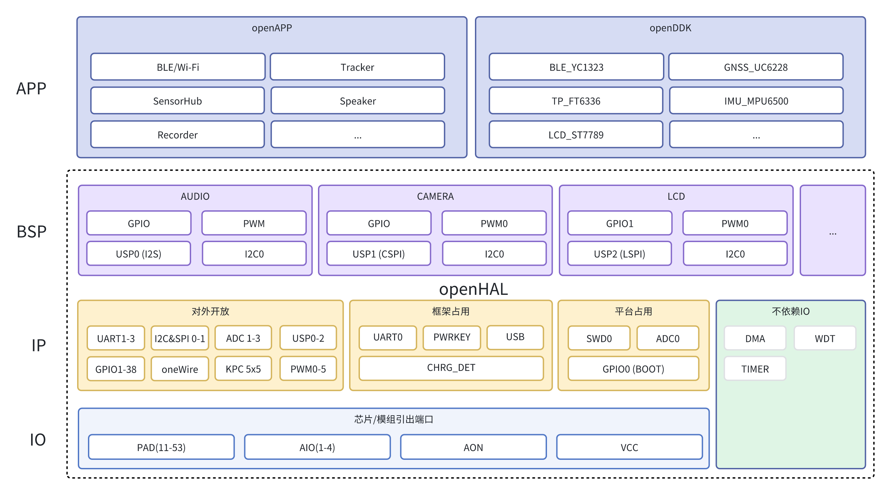
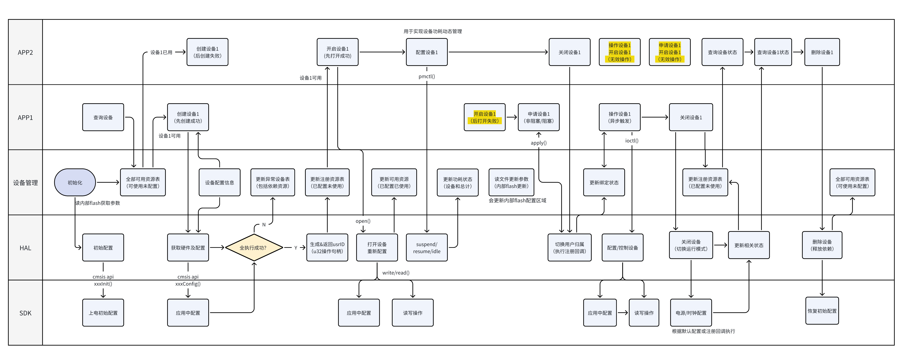

# 框架总览

openHAL对硬件资源统一管理，对上层提供统一的硬件层API接口，对底层芯片层API如CMSIS进行二次封装，提供类Android Things、PikaPython、linux等风格接口。

* 提供可靠且稳定的标准化接口，统一管理外设，实现资源的灵活复用；
* 提供和主流软件平台兼容或适配的操作层，例如各种开源工程及系统；

<div class="image-container">




</div>

## 接口分类

<div class="table-center">

|    HAL    | startup | create/delete | open/close | read/write | ioctl/pmctl | query |
| :--------: | :-----: | :-----------: | :--------: | :--------: | :---------: | :---: |
|  [PAD](#pad)  |   √   |      √      |     √     |     √     |     √     |  √  |
| [GPIO](#gpio) |   √   |      √      |     √     |     √     |     √     |  √  |
| [UART](#uart) |   √   |      √      |     √     |     √     |     √     |  √  |
|  [I2C](#i2c)  |   √   |      √      |     √     |     √     |     √     |  √  |
|  [SPI](#spi)  |   √   |      √      |     √     |     √     |     √     |  √  |
|  [PWM](#pwm)  |   √   |      √      |     √     |     √     |     √     |  √  |

</div>


EC7XX系列PAD类比传统MCU的GPIO，具有唯一标识，作为其余外设的依赖；除依赖IO的，还有DMA/TIM等不依赖IO的IP；

## 函数分类

<div class="table-center">

|    OPEN API    | param[in] | param[out] | return |        brief        |
| :-------------: | :-------: | :--------: | :----: | :------------------: |
| api_xxx_startup |     -     |     -     |   -   |   上电全局参数配置   |
|  api_xxx_setup  |     -     |     -     |   -   |  执行外设的实际配置  |
|  api_xxx_parse  |     -     |     -     |   -   |  CSV表跟化数据解析  |
|  api_xxx_query  |    √    |     -     |  enum  |       查询接口       |
| api_xxx_create |    √    |            |   √   |  创建设备动态表更新  |
|  api_xxx_open  |  timeout  |    inf    |  enum  |  开启回调，系统通知  |
|  api_xxx_apply  |   func   |    cnf    |  enum  |        预注册        |
|  api_xxx_ioctl  |   enum   |            |        |       配置设备       |
|  api_xxx_pmctl  |   enum   |            |        |  配置设备功耗/模式  |
|  api_xxx_write  |    √    |     -     |        |        写操作        |
|  api_xxx_read  |     -     |     √     |        |        读操作        |
|  api_xxx_close  |   func   |     -     |  enum  | 关闭，回调，系统通知 |
| api_xxx_delete |    √    |     -     |  enum  | 删除设备，动态表更新 |
|  api_test_xxx  |          |            |        |       测试接口       |

</div>


用户可以将上电默认的状态写入到对应的list中，例如 padList/gpioList，这最先加载，**全局共用**，之后才会被用户参数覆盖或读取文件配置；


### 基本功能接口：

* 获取/释放资源create()/delete()
* 针对状态的查询接口 query()
* 针对设备的操作和配置 ioctl()
* startup()用于执行上电初始化，执行全局同类配置，例如整个设备表的38个GPIO同时配置，对应setup接口执行特定index配置；
* parse()模块用于解析对应数据存储到该模块的flash区域，对来源不同的结构化数据读取；
* api_xxx_setup()用于执行单项初始化，会将实际的配置数据写入外设，也是后续唯一能修改外设配置的接口；
* ec_xxx_checkout()用于查询外设的硬件IO依赖状态，主要是PAD的MUX是否已经对应配置，如果没有对应配置返回错误，用户先配置PAD的MUX，然后执行对应外设的setup接口；

### api_xxx_setup接口说明

`api_xxx_setup()`是各外设模块的核心配置接口，用于执行单项设备初始化，将配置数据写入硬件寄存器。每个外设的setup接口具有以下特点：

1. **单项初始化**：针对指定索引的单个外设实例进行配置
2. **硬件配置**：直接操作硬件寄存器，完成外设功能配置
3. **参数统一**：使用HAL层统一的参数格式
4. **幂等性**：可重复调用，用于修改外设配置
5. **依赖检查**：通常在调用前需要确保依赖资源(PAD引脚等)已正确配置


# 使用指南

## 工程配置

在工程的makefile中通过宏开启：

```bash
SUBSYS_OPENHAL_ENABLE           = y
```

配置文件通过CSV表格打包，烧录内部文件系统，更新方式包括：


* 在工程路径下，通过编译打包直接烧录
* 通过Python脚本上传文件到文件系统


## 调用流程

默认的调用流程为：startup() -> create() -> open() -> query() -> close() -> delete()

- 在 `startup()` 和 `open()/close()` 中会实际调用 `setup()` 接口改变外设的参数配置；
- 通过 `create()` 可以检查外设的依赖是否满足，不满足则返回对应错误，但该接口不修改配置；
- `ioctl()` 在使用中配置外设功能，也可能调用 `setup()` 修改硬件功能；

# 外设说明

## pad

PAD是芯片的物理引脚，所有外设功能都需要通过PAD引脚与外部连接。EC7XX系列芯片的PAD编号从11到53。

<div class="table-center">

|               API               | param[in] | param[out] | return |    brief    |
| :------------------------------: | :--------: | :--------: | :----: | :----------: |
| [api_pad_startup](#api_pad_startup) |     -     |     √     |   √   | 加载全局配置 |
|   [api_pad_setup](#api_pad_setup)   |     |     -     |   -   |   设置接口   |
|   [api_pad_parse](#api_pad_parse)   |  str,cfg  |     -     |  enum  | 解析配置数据 |
|  [api_pad_create](#api_pad_create)  |   paddr   |   config   |  enum  |   申请接口   |
|    [api_pad_open](#api_pad_open)    | usrId,cfg |     -     |  enum  |   申请接口   |
|   [api_pad_query](#api_pad_query)   |   usrId   |     -     |  enum  |   查询接口   |
|   [api_pad_ioctl](#api_pad_ioctl)   | usrId,type |     -     |   -   |   配置接口   |
|   [api_pad_pmctl](#api_pad_pmctl)   | usrId,cfg |     -     |   -   |   功耗模式   |
|   [api_pad_close](#api_pad_close)   |   usrId   |     -     |  enum  |   关闭接口   |
|  [api_pad_delete](#api_pad_delete)  |   usrId   |     -     |  enum  |   删除接口   |
|    [api_test_pad](#api_test_pad)    |     -     |     -     |   -   |   测试接口   |

</div>


### api_pad_startup

全局PAD初始化，如果传入参数则更新默认全局列表，否则已现有的全局列表初始化所有PAD功能，每项参数统一 `int8_t` 通过正负值反馈不同状态；


* 传入的参数需要是pad列表而非某个pad配置项；
* 该函数用于在系统上电时初始化所有PAD设备，它会遍历所有可用的PAD索引；
* 如果para不为NULL，则会使用默认的全局参数；


函数声明：
`int8_t *api_pad_startup(int8_t *para);`

参数说明：

* `para` - 指向PAD配置参数数组的指针，每个元素包含4个字段：
  - 第一项是PAD编号: 如果不通过全局控制则需配置为-1
  - 第二项是MUX功能选择：PAD_MUX_ALT0~PAD_MUX_ALT7
  - 第三项是上拉/下拉配置：PAD_AUTO_PULL(自动), PAD_INTERNAL_PULL_UP(内部上拉), PAD_INTERNAL_PULL_DOWN(内部下拉)
  - 第四项是locked参数：0=可以被参数覆盖且写入寄存器，1=不可以被新参数覆盖，-1=只读不写寄存器

返回值：

* 返回指向PAD状态列表的指针


### api_pad_setup


函数声明：
`api_ret_t api_pad_setup(int8_t index,pad_config_t* para);`


### api_pad_parse


该函数用于解析CSV格式的PAD配置字符串，并通过导出解析数据或调用 `setup()` 配置到实际的PAD。


函数声明：
`int32_t api_pad_parse(char* str, pad_config_t *cfg);`

参数说明：

* `str` - CSV格式的配置字符串，包含7个字段：
  - PAD编号
  - MUX功能选择 (0-7)
  - 上拉使能 (0-1)
  - 下拉使能 (0-1)
  - 拉电阻选择 (0-1)
  - 输入控制 (0-1)
  - 输出控制 (0-1)
* `cfg` - 解析后的配置参数结构体指针

返回值：

* PAD索引编号


### api_pad_create

创建PAD设备实例，分配资源并检查依赖条件。

函数声明：
`api_ret_t api_pad_create(uint32_t paddr, void *out);`

参数说明：

* `paddr` - PAD物理地址 (11-53)
* `out` - 输出参数，返回创建的PAD设备ID

返回值：

* 执行结果，OPEN_HAL_DONE表示成功

详细说明：
该函数用于创建一个新的PAD设备实例，分配相关资源并进行初始化。如果对应的PAD已经被锁定，则返回锁定状态。

### api_pad_open

打开PAD设备。

函数声明：
`api_ret_t api_pad_open(uint32_t usrId, void *cfg, size_t timeout);`

参数说明：

* `usrId` - PAD设备ID
* `cfg` - PAD配置参数指针（可为NULL）
* `timeout` - 超时时间（暂未使用）

返回值：

* 执行结果，OPEN_HAL_DONE表示成功

详细说明：
该函数用于打开PAD设备并根据配置参数进行设置。只有在PAD处于空闲状态时才能被打开。

### api_pad_apply

占用pad并回调，依赖rtos。

函数声明：
`api_ret_t api_pad_apply(uint32_t usrId,void *cb);`

参数说明：

* `usrId` - PAD设备ID
* `cb` - 回调函数指针

返回值：

* 执行结果

详细说明：
系统级接口，非阻塞，获取pad成功后回调，可用于共用外设端口情况。

注意：该功能待实现，需要根据RTOS环境实现具体功能。

### api_pad_query

查询PAD设备状态。

函数声明：
`api_ret_t api_pad_query(uint32_t usrId);`

参数说明：

* `usrId` - PAD设备ID

返回值：

* PAD设备当前状态：
  - OPEN_HAL_FREE: 未分配
  - OPEN_HAL_IDLE: 空闲
  - OPEN_HAL_USED: 使用中
  - OPEN_HAL_NONE: 无效
  - OPEN_HAL_LOCK: 锁定

详细说明：
该函数用于查询指定PAD设备的当前状态（空闲、使用中等）。

### api_pad_ioctl

PAD设备控制接口，用于配置设备的各种参数。

函数声明：
`api_ret_t api_pad_ioctl(uint32_t usrId, api_pad_ioctl_t type, void *para);`

参数说明：

* `usrId` - PAD设备ID
* `type` - 控制类型，参考api_pad_ioctl_t枚举：
  - OPEN_PAD_IOCTL_FUNC: 设置功能
  - OPEN_PAD_IOCTL_PULLUP: 设置上拉电阻
  - OPEN_PAD_IOCTL_PULLDOWN: 设置下拉电阻
  - OPEN_PAD_IOCTL_PULLSELECT: 设置拉电阻选择
* `para` - 控制参数指针

返回值：

* 执行结果

详细说明：
该函数用于对PAD设备进行各种控制操作，如设置功能、上拉/下拉电阻等。只有在PAD处于使用中状态时才能进行控制操作。

### api_pad_pmctl

对设备功耗和模式进行配置。

函数声明：
`api_ret_t api_pad_pmctl(uint32_t usrId, open_hal_pm_t *cfg, size_t count);`

参数说明：

* `usrId` - PAD设备ID
* `cfg` - 功耗配置参数指针
* `count` - 参数数量（暂未使用）

返回值：

* 执行结果

详细说明：
该函数用于控制PAD设备的功耗模式。只有在PAD处于使用中状态时才能进行功耗控制。

### api_pad_close

关闭PAD设备。

函数声明：
`api_ret_t api_pad_close(uint32_t usrId);`

参数说明：

* `usrId` - PAD设备ID

返回值：

* 执行结果

详细说明：
该函数用于关闭指定的PAD设备，将其状态设置为空闲。只有在PAD处于使用中状态时才能被关闭。

### api_pad_delete

删除PAD设备实例，释放相关资源。

函数声明：
`api_ret_t api_pad_delete(uint32_t usrId);`

参数说明：

* `usrId` - PAD设备ID

返回值：

* 执行结果

详细说明：
该函数用于删除指定的PAD设备实例，释放相关资源。只有在PAD处于空闲状态时才能被删除。

### api_test_pad

PAD设备测试接口。

函数声明：
`int api_test_pad(void);`

返回值：

* 测试结果

详细说明：
该函数用于测试PAD设备的基本功能。目前尚未实现具体功能。

注意：该功能待实现，需要实现PAD设备的完整测试流程。

## gpio

GPIO (General Purpose Input/Output) 是通用输入/输出端口，可用于与外部设备进行数字信号交互。


<div class="table-center">

|                API                | param[in] | param[out] | return |    brief    |
| :--------------------------------: | :-------: | :--------: | :----: | :----------: |
| [api_gpio_startup](#api_gpio_startup) |     -     |     -     |   -   | 加载默认配置 |
|   [api_gpio_parse](#api_gpio_parse)   |     -     |     -     |  enum  | 解析配置数据 |
|  [api_gpio_create](#api_gpio_create)  |   index   |    cfg    |   √   |   申请接口   |
|    [api_gpio_open](#api_gpio_open)    |   usrId   |    cfg    |  enum  |   申请接口   |
|   [api_gpio_setup](#api_gpio_setup)   |   index   |    para    |  enum  |    初始化    |
|   [api_gpio_write](#api_gpio_write)   |   usrId   |    buf    |   -   |    写操作    |
|    [api_gpio_read](#api_gpio_read)    |   usrId   |    buf    |   -   |    读操作    |
|   [api_gpio_ioctl](#api_gpio_ioctl)   |   usrId   |    type    |   -   |   配置接口   |
|   [api_gpio_close](#api_gpio_close)   |   usrId   |     -     |  enum  |   关闭接口   |
|  [api_gpio_delete](#api_gpio_delete)  |   usrId   |     -     |  enum  |   删除接口   |
|   [api_gpio_query](#api_gpio_query)   |   usrId   |     -     |  enum  |   查询接口   |
| [api_gpio_default](#api_gpio_default) |   list   |   count   |   -   | 重置默认状态 |
|    [api_test_gpio](#api_test_gpio)    |     -     |     -     |   -   |   测试接口   |

</div>


### api_gpio_startup

默认配置数据导出，加载GPIO默认配置并初始化。该函数会初始化所有可用的GPIO设备，将它们设置为空闲状态，以便后续使用。

函数声明：
`int8_t *api_gpio_startup(int8_t *pin, int8_t *pad);`

参数说明：

* `pin` - 指向GPIO配置参数数组的指针
* `pad` - 指向PAD配置参数数组的指针

返回值：

* 返回指向GPIO状态列表的指针

### api_gpio_setup

该函数对指定索引的GPIO进行独立配置，支持方向、默认输出值、锁存、模式等属性设置。是底层硬件初始化的核心接口之一。

函数声明：
`api_ret_t api_gpio_setup(int8_t index, gpio_config_t* para);`

参数说明：

* `index` - GPIO索引编号 (0-38)
* `para` - GPIO配置参数指针

返回值：

* 执行结果

### api_gpio_parse

CSV配置数据的解析导出，用于从CSV格式的配置字符串中解析出GPIO配置参数。

函数声明：
`int32_t api_gpio_parse(char* str, gpio_config_t *cfg);`

参数说明：

* `str` - CSV格式的配置字符串
* `cfg` - 解析后的配置参数结构体指针

返回值：

* GPIO索引编号

### api_gpio_create

创建GPIO设备实例，分配资源并检查依赖条件。

函数声明：
`api_ret_t api_gpio_create(uint32_t index, void *cfg, void *out);`

参数说明：

* `index` - GPIO索引编号 (0-38)
* `cfg` - GPIO配置参数指针（可为NULL）
* `out` - 输出参数，返回创建的GPIO设备ID

返回值：

* 执行结果

### api_gpio_open

系统级接口，用于打开和配置GPIO设备。

函数声明：
`api_ret_t api_gpio_open(uint32_t usrId,void *cfg,size_t timeout);`

参数说明：

* `usrId` - GPIO设备ID
* `cfg` - GPIO配置参数指针（可为NULL）
* `timeout` - 超时时间（暂未使用）

返回值：

* 执行结果

如果在超时时间内，申请的usrId是空闲状态，则获取成功，并以传入的cfg参数初始化;
如果在超时时间内，申请的usrId是关闭状态，则获取成功，GPIO的配置参数以cfg传出;
超时未获取成功，通过open_hal_ack_t枚举返回状态;

### api_gpio_write

向GPIO设备写入数据，设置输出引脚的电平状态。

函数声明：
`api_ret_t api_gpio_write(uint32_t usrId, void* buf, size_t count);`

参数说明：

* `usrId` - GPIO设备ID
* `buf` - 要写入的数据缓冲区指针
* `count` - 要写入的数据大小（字节数）

返回值：

* 执行结果

### api_gpio_read

从GPIO设备读取数据，获取输入引脚的电平状态。

函数声明：
`api_ret_t api_gpio_read(uint32_t usrId, void* buf, size_t count);`

参数说明：

* `usrId` - GPIO设备ID
* `buf` - 读取数据的缓冲区指针
* `count` - 要读取的数据大小（字节数）

返回值：

* 执行结果

### api_gpio_ioctl

GPIO设备控制接口，用于配置设备的各种参数，如方向、中断回调等。

函数声明：
`api_ret_t api_gpio_ioctl(uint32_t usrId,api_gpio_ioctl_t type, void *para);`

参数说明：

* `usrId` - GPIO设备ID
* `type` - 控制类型，参考api_gpio_ioctl_t枚举
* `para` - 控制参数指针

返回值：

* 执行结果

参数举例：

* 使用 *OPEN_GPIO_IOCTL_OUT_ACT* 实现可以软件定义GPIO物理输出的高低状态交换，便于在特定场合下硬件调整不影响应用层功能：1=状态交换，0=实际状态；

### api_gpio_close

关闭GPIO设备。

函数声明：
`api_ret_t api_gpio_close(uint32_t usrId);`

参数说明：

* `usrId` - GPIO设备ID

返回值：

* 执行结果

### api_gpio_delete

删除GPIO设备实例，释放相关资源。

函数声明：
`api_ret_t api_gpio_delete(uint32_t usrId);`

参数说明：

* `usrId` - GPIO设备ID

返回值：

* 执行结果

### api_gpio_query

查询GPIO设备状态。

函数声明：
`api_ret_t api_gpio_query(uint32_t usrId);`

参数说明：

* `usrId` - GPIO设备ID

返回值：

* GPIO设备当前状态

### api_gpio_default

重置GPIO列表到默认状态。

函数声明：
`void api_gpio_default(int8_t (*list)[4], uint8_t count);`

参数说明：

* `list` - 指向GPIO列表的指针
* `count` - 列表中元素的数量

返回值：

* 无

### api_test_gpio

GPIO设备测试接口。

函数声明：
`int api_test_gpio(void);`

返回值：

* 测试结果

## uart

UART (Universal Asynchronous Receiver-Transmitter) 是一种通用串行数据链路标准，用于异步串行通信。

<div class="table-center">

|                 API                 | param[in] | param[out] | return |    brief    |
| :----------------------------------: | :-------: | :--------: | :----: | :----------: |
| [api_uart_checkout](#api_uart_checkout) |  rxd,txd  |     -     |  enum  | 检查引脚配置 |
|  [api_uart_startup](#api_uart_startup)  |   para   |    pad    |   √   | 加载默认配置 |
|    [api_uart_parse](#api_uart_parse)    |    str    |    cfg    |  enum  | 解析配置数据 |
|   [api_uart_create](#api_uart_create)   |   index   |    cfg    |   √   |   申请接口   |
|     [api_uart_open](#api_uart_open)     |   usrId   |    cfg    |  enum  |   申请接口   |
|    [api_uart_setup](#api_uart_setup)    |   index   |    para    |  enum  |    初始化    |
|    [api_uart_write](#api_uart_write)    |   usrId   |    buf    |   -   |    写操作    |
|     [api_uart_read](#api_uart_read)     |   usrId   |    buf    |   -   |    读操作    |
|    [api_uart_ioctl](#api_uart_ioctl)    |   usrId   |    type    |   -   |   配置接口   |
|    [api_uart_close](#api_uart_close)    |   usrId   |     -     |  enum  |   关闭接口   |
|   [api_uart_delete](#api_uart_delete)   |   usrId   |     -     |  enum  |   删除接口   |
|     [api_test_uart](#api_test_uart)     |     -     |     -     |   -   |   测试接口   |

</div>

### api_uart_checkout

检查UART接口的引脚配置是否正确。

函数声明：
`api_ret_t api_uart_checkout(int8_t rxd, int8_t txd, int8_t rts, int8_t cts);`

参数说明：

* `rxd` - UART接收数据引脚编号
* `txd` - UART发送数据引脚编号
* `rts` - UART请求发送引脚编号（暂未使用）
* `cts` - UART清除发送引脚编号（暂未使用）

返回值：

* 检查结果，OPEN_HAL_DONE表示成功，其他值表示失败

### api_uart_startup

默认配置数据导出，加载UART默认配置并初始化。该函数会初始化所有可用的UART设备，将它们设置为空闲状态，以便后续使用。

函数声明：
`int8_t *api_uart_startup(void* para, int8_t *pad);`

参数说明：

* `para` - 指向UART配置参数数组的指针
* `pad` - 指向PAD配置参数数组的指针

返回值：

* 返回指向UART状态列表的指针

### api_uart_parse

CSV配置数据的解析导出，用于从CSV格式的配置字符串中解析出UART配置参数。

函数声明：
`int32_t api_uart_parse(char* str, uart_config_t *cfg);`

参数说明：

* `str` - CSV格式的配置字符串
* `cfg` - 解析后的配置参数结构体指针

返回值：

* UART索引编号

配置字符串应包含11个字段：
* 0: 索引
* 1: rxd引脚
* 2: txd引脚
* 3: rts引脚
* 4: cts引脚
* 5: 波特率
* 6: 工作模式
* 7: 数据位 (5-9)
* 8: 校验位 (0=None, 1=Odd, 2=Even)
* 9: 停止位 (0=1 bit, 1=2 bits)
* 10: 流控位 (0=None, 1=RTS, 2=CTS, 3=RTS/CTS)

### api_uart_create

创建UART设备实例，分配资源并检查依赖条件。

函数声明：
`api_ret_t api_uart_create(int8_t index, uart_config_t *cfg, void *out);`

参数说明：

* `index` - UART索引编号
* `cfg` - UART配置参数指针（可为NULL）
* `out` - 输出参数，返回创建的UART设备ID

返回值：

* 执行结果

### api_uart_open

系统级接口，用于打开和配置UART设备。

函数声明：
`api_ret_t api_uart_open(uint32_t usrId,void *cfg,size_t timeout);`

参数说明：

* `usrId` - UART设备ID
* `cfg` - UART配置参数指针（可为NULL）
* `timeout` - 超时时间

返回值：

* 执行结果

如果在超时时间内，申请的usrId是空闲状态，则获取成功，并以传入的cfg参数初始化;
如果在超时时间内，申请的usrId是关闭状态，则获取成功，UART的配置参数以cfg传出;
超时未获取成功，通过open_hal_ack_t枚举返回状态;

### api_uart_setup

该函数用于初始化指定的UART设备，配置其通信参数如波特率、数据位、停止位、校验位等。

函数声明：
`api_ret_t api_uart_setup(int8_t index, uart_config_t* para);`

参数说明：

* `index` - UART索引编号
* `para` - UART配置参数指针

返回值：

* 执行结果

### api_uart_write

向UART设备写入数据。

函数声明：
`api_ret_t api_uart_write(uint32_t usrId, void* buf, size_t count);`

参数说明：

* `usrId` - UART设备ID
* `buf` - 要写入的数据缓冲区指针
* `count` - 要写入的数据大小（字节数）

返回值：

* 执行结果

### api_uart_read

从UART设备读取数据。

函数声明：
`api_ret_t api_uart_read(uint32_t usrId, void* buf, size_t count);`

参数说明：

* `usrId` - UART设备ID
* `buf` - 读取数据的缓冲区指针
* `count` - 要读取的数据大小（字节数）

返回值：

* 执行结果

### api_uart_ioctl

UART设备控制接口，用于配置设备的各种参数。

函数声明：
`api_ret_t api_uart_ioctl(uint32_t usrId, api_uart_ioctl_t type, void *para);`

参数说明：

* `usrId` - UART设备ID
* `type` - 控制类型，参考api_uart_ioctl_t枚举
* `para` - 控制参数指针

返回值：

* 执行结果

### api_uart_close

关闭UART设备。

函数声明：
`api_ret_t api_uart_close(uint32_t usrId);`

参数说明：

* `usrId` - UART设备ID

返回值：

* 执行结果

### api_uart_delete

删除UART设备实例，释放相关资源。

函数声明：
`api_ret_t api_uart_delete(uint32_t usrId);`

参数说明：

* `usrId` - UART设备ID

返回值：

* 执行结果

### api_test_uart

UART设备测试接口。

函数声明：
`int api_test_uart(void);`

返回值：

* 测试结果

## i2c

I2C (Inter-Integrated Circuit) 是一种串行通信协议，用于连接微控制器和外围设备。

<div class="table-center">

|               API               | param[in] | param[out] | return |    brief    |
| :------------------------------: | :-------: | :--------: | :----: | :----------: |
| [api_i2c_startup](#api_i2c_startup) |   para   |    pad    |   √   | 加载默认配置 |
|   [api_i2c_parse](#api_i2c_parse)   |    str    |    cfg    |  enum  | 解析配置数据 |
|  [api_i2c_create](#api_i2c_create)  |   index   |    cfg    |   √   |   申请接口   |
|    [api_i2c_open](#api_i2c_open)    |   usrId   |    cfg    |  enum  |   申请接口   |
|   [api_i2c_setup](#api_i2c_setup)   |   index   |    para    |  enum  |    初始化    |
|   [api_i2c_write](#api_i2c_write)   |   usrId   |    buf    |   -   |    写操作    |
|    [api_i2c_read](#api_i2c_read)    |   usrId   |    buf    |   -   |    读操作    |
|   [api_i2c_ioctl](#api_i2c_ioctl)   |   usrId   |    type    |   -   |   配置接口   |
|   [api_i2c_close](#api_i2c_close)   |   usrId   |     -     |  enum  |   关闭接口   |
|  [api_i2c_delete](#api_i2c_delete)  |   usrId   |     -     |  enum  |   删除接口   |
|    [api_test_i2c](#api_test_i2c)    |     -     |     -     |   -   |   测试接口   |

</div>

### api_i2c_startup

默认配置数据导出，加载I2C默认配置并初始化。

函数声明：
`int8_t *api_i2c_startup(void* para, int8_t *pad);`

参数说明：

* `para` - 指向I2C配置参数数组的指针
* `pad` - 指向PAD配置参数数组的指针

返回值：

* 返回指向I2C状态列表的指针

### api_i2c_parse

CSV配置数据的解析导出，用于从CSV格式的配置字符串中解析出I2C配置参数。

函数声明：
`int32_t api_i2c_parse(char* str, i2c_config_t *cfg);`

参数说明：

* `str` - CSV格式的配置字符串
* `cfg` - 解析后的配置参数结构体指针

返回值：

* I2C索引编号

### api_i2c_create

创建I2C设备实例，分配资源并检查依赖条件。

函数声明：
`api_ret_t api_i2c_create(int8_t index, i2c_config_t *cfg, void *out);`

参数说明：

* `index` - I2C索引编号
* `cfg` - I2C配置参数指针（可为NULL）
* `out` - 输出参数，返回创建的I2C设备ID

返回值：

* 执行结果

### api_i2c_open

系统级接口，用于打开和配置I2C设备。

函数声明：
`api_ret_t api_i2c_open(uint32_t usrId,void *cfg,size_t timeout);`

参数说明：

* `usrId` - I2C设备ID
* `cfg` - I2C配置参数指针（可为NULL）
* `timeout` - 超时时间

返回值：

* 执行结果

### api_i2c_setup

单项初始化，使用HAL统一的参数格式，会执行硬件配置。

函数声明：
`api_ret_t api_i2c_setup(int8_t index, i2c_config_t* para);`

参数说明：

* `index` - I2C索引编号
* `para` - I2C配置参数指针

返回值：

* 执行结果

### api_i2c_write

向I2C设备写入数据。

函数声明：
`api_ret_t api_i2c_write(uint32_t usrId, void* buf, size_t count);`

参数说明：

* `usrId` - I2C设备ID
* `buf` - 要写入的数据缓冲区指针
* `count` - 要写入的数据大小（字节数）

返回值：

* 执行结果

### api_i2c_read

从I2C设备读取数据。

函数声明：
`api_ret_t api_i2c_read(uint32_t usrId, void* buf, size_t count);`

参数说明：

* `usrId` - I2C设备ID
* `buf` - 读取数据的缓冲区指针
* `count` - 要读取的数据大小（字节数）

返回值：

* 执行结果

### api_i2c_ioctl

I2C设备控制接口，用于配置设备的各种参数。

函数声明：
`api_ret_t api_i2c_ioctl(uint32_t usrId, api_i2c_ioctl_t type, void *para);`

参数说明：

* `usrId` - I2C设备ID
* `type` - 控制类型，参考api_i2c_ioctl_t枚举
* `para` - 控制参数指针

返回值：

* 执行结果

### api_i2c_close

关闭I2C设备。

函数声明：
`api_ret_t api_i2c_close(uint32_t usrId);`

参数说明：

* `usrId` - I2C设备ID

返回值：

* 执行结果

### api_i2c_delete

删除I2C设备实例，释放相关资源。

函数声明：
`api_ret_t api_i2c_delete(uint32_t usrId);`

参数说明：

* `usrId` - I2C设备ID

返回值：

* 执行结果

### api_test_i2c

I2C设备测试接口。

函数声明：
`int api_test_i2c(void);`

返回值：

* 测试结果

## spi

SPI (Serial Peripheral Interface) 是一种同步串行通信协议，常用于短距离通信。

<div class="table-center">

|                API                |   param[in]   | param[out] | return |    brief    |
| :--------------------------------: | :------------: | :--------: | :----: | :----------: |
|  [api_spi_startup](#api_spi_startup)  |      para      |    pad    |   √   | 加载默认配置 |
|    [api_spi_parse](#api_spi_parse)    |      str      |    cfg    |  enum  | 解析配置数据 |
|   [api_spi_create](#api_spi_create)   |     index     |    cfg    |   √   |   申请接口   |
|     [api_spi_open](#api_spi_open)     |     usrId     |    cfg    |  enum  |   申请接口   |
|    [api_spi_setup](#api_spi_setup)    |     index     |    para    |  enum  |    初始化    |
|    [api_spi_write](#api_spi_write)    |     usrId     |    buf    |   -   |    写操作    |
|     [api_spi_read](#api_spi_read)     |     usrId     |    buf    |   -   |    读操作    |
|    [api_spi_ioctl](#api_spi_ioctl)    |     usrId     |    type    |   -   |   配置接口   |
|    [api_spi_close](#api_spi_close)    |     usrId     |     -     |  enum  |   关闭接口   |
|   [api_spi_delete](#api_spi_delete)   |     usrId     |     -     |  enum  |   删除接口   |
| [api_spi_checkout](#api_spi_checkout) | mosi,miso,sclk |     -     |  enum  | 检查引脚配置 |
|     [api_test_spi](#api_test_spi)     |       -       |     -     |   -   |   测试接口   |

</div>

### api_spi_startup

默认配置数据导出，加载SPI默认配置并初始化。

函数声明：
`int8_t *api_spi_startup(void* para, int8_t *pad);`

参数说明：

* `para` - 指向SPI配置参数数组的指针
* `pad` - 指向PAD配置参数数组的指针

返回值：

* 返回指向SPI状态列表的指针

### api_spi_parse

CSV配置数据的解析导出，用于从CSV格式的配置字符串中解析出SPI配置参数。

函数声明：
`int32_t api_spi_parse(char* str, spi_config_t *cfg);`

参数说明：

* `str` - CSV格式的配置字符串
* `cfg` - 解析后的配置参数结构体指针

返回值：

* SPI索引编号

### api_spi_create

创建SPI设备实例，分配资源并检查依赖条件。

函数声明：
`api_ret_t api_spi_create(uint32_t index,void *cfg, void *out);`

参数说明：

* `index` - SPI索引编号 (0-1)
* `cfg` - SPI配置参数指针（可为NULL）
* `out` - 输出参数，返回创建的SPI设备ID

返回值：

* 执行结果

### api_spi_open

系统级接口，用于打开和配置SPI设备。

函数声明：
`api_ret_t api_spi_open(uint32_t usrId,void *cfg,size_t timeout);`

参数说明：

* `usrId` - SPI设备ID
* `cfg` - SPI配置参数指针（可为NULL）
* `timeout` - 超时时间

返回值：

* 执行结果

### api_spi_setup

单项初始化，使用HAL统一的参数格式，会执行硬件配置。

函数声明：
`api_ret_t api_spi_setup(int8_t index, spi_config_t* para);`

参数说明：

* `index` - SPI索引编号
* `para` - SPI配置参数指针

返回值：

* 执行结果

### api_spi_write

向SPI设备写入数据。

函数声明：
`api_ret_t api_spi_write(uint32_t usrId, void* buf, size_t count);`

参数说明：

* `usrId` - SPI设备ID
* `buf` - 要写入的数据缓冲区指针
* `count` - 要写入的数据大小（字节数）

返回值：

* 执行结果

### api_spi_read

从SPI设备读取数据。

函数声明：
`api_ret_t api_spi_read(uint32_t usrId, void* buf, size_t count);`

参数说明：

* `usrId` - SPI设备ID
* `buf` - 读取数据的缓冲区指针
* `count` - 要读取的数据大小（字节数）

返回值：

* 执行结果

### api_spi_ioctl

SPI设备控制接口，用于配置设备的各种参数。

函数声明：
`api_ret_t api_spi_ioctl(uint32_t usrId, api_spi_ioctl_t type, void *para);`

参数说明：

* `usrId` - SPI设备ID
* `type` - 控制类型，参考api_spi_ioctl_t枚举
* `para` - 控制参数指针

返回值：

* 执行结果

### api_spi_close

关闭SPI设备。

函数声明：
`api_ret_t api_spi_close(uint32_t usrId);`

参数说明：

* `usrId` - SPI设备ID

返回值：

* 执行结果

### api_spi_delete

删除SPI设备实例，释放相关资源。

函数声明：
`api_ret_t api_spi_delete(uint32_t usrId);`

参数说明：

* `usrId` - SPI设备ID

返回值：

* 执行结果

### api_spi_checkout

检查SPI接口的引脚配置是否正确。

函数声明：
`api_ret_t api_spi_checkout(int8_t mosi, int8_t miso, int8_t sclk);`

参数说明：

* `mosi` - SPI主输出从输入引脚编号
* `miso` - SPI主输入从输出引脚编号
* `sclk` - SPI时钟引脚编号

返回值：

* 检查结果，OPEN_HAL_DONE表示成功，其他值表示失败

### api_test_spi

SPI设备测试接口。

函数声明：
`int api_test_spi(void);`

返回值：

* 测试结果

## pwm

<div class="table-center">

|                API                | param[in] | param[out] | return |       brief       |
| :--------------------------------: | :--------: | :--------: | :----: | :---------------: |
|  [api_pwm_startup](#api_pwm_startup)  |     -     |     √     |  enum  |   加载默认配置   |
|    [api_pwm_parse](#api_pwm_parse)    |            |     -     |  enum  |   解析配置数据   |
|   [api_pwm_create](#api_pwm_create)   | pin/pwm_n |   config   |  enum  |     申请接口     |
|     [api_pwm_open](#api_pwm_open)     |  timeout  |            |  enum  |     申请接口     |
|           api_pwm_query           | pin/usrId |     -     |  enum  |     查询接口     |
|    [api_pwm_ioctl](#api_pwm_ioctl)    |            |            |        |     配置接口     |
|           api_pwm_pmctl           |            |            |        | 运行状态/功耗模式 |
|           api_pwm_close           |   usrId   |            |  enum  |     关闭接口     |
|           api_pwm_delete           |   usrId   |            |  enum  |     删除接口     |
| [api_pwm_checkout](#api_pwm_checkout) | pin, pwm_n |            |  enum  |   检查引脚配置   |
|           api_pwm_write           | usrId, buf |            |  enum  |      写操作      |
|            api_pwm_read            | usrId, buf |     √     |  enum  |      读操作      |
|            api_test_pwm            |            |            |        |     测试接口     |

</div>

### api_pwm_checkout

检查PWM接口的引脚配置是否正确。

函数声明：
`api_ret_t api_pwm_checkout(int8_t pin, int8_t pwm_n);`

参数说明：

* `pin` - PWM正极引脚编号
* `pwm_n` - PWM负极引脚编号（暂未使用）

返回值：

* 检查结果，OPEN_HAL_DONE表示成功，其他值表示失败

该函数用于检查指定的PWM引脚配置是否正确。它会验证 `pin`或 `pwm_n`引脚是否在预定义的引脚表中，并且对应的PAD是否已配置为PWM功能。

### api_pwm_startup

所有PWM上电初始化为配置状态。

函数声明：
`int8_t *api_pwm_startup(void* para, int8_t *pad);`

参数说明：

* `para` - 指向PWM配置参数数组的指针（暂未使用）
* `pad` - 指向PAD配置参数数组的指针

返回值：

* 返回指向PWM状态列表的指针

### api_pwm_parse

解析PWM配置字符串。

函数声明：
`int32_t api_pwm_parse(char* str, pwm_config_t *cfg);`

参数说明：

* `str` - PWM配置字符串
* `cfg` - PWM配置参数结构体指针

返回值：

* PWM索引，负值表示失败

### api_pwm_create

创建PWM设备实例，分配资源并检查依赖条件。

函数声明：
`api_ret_t api_pwm_create(int8_t index, pwm_config_t *cfg, void *out);`

参数说明：

* `index` - PWM索引
* `cfg` - PWM配置参数指针
* `out` - 输出参数，返回创建的PWM设备ID

返回值：

* 执行结果，OPEN_HAL_DONE表示成功

create接口只查询依赖硬件的状态（pad/clk）和分配mem空间资源，不执行硬件配置。

### api_pwm_open

打开PWM设备。

函数声明：
`api_ret_t api_pwm_open(uint32_t usrId, pwm_config_t *cfg, size_t timeout);`

参数说明：

* `usrId` - PWM设备用户ID
* `cfg` - PWM配置参数指针
* `timeout` - 超时时间（暂未使用）

返回值：

* 执行结果，OPEN_HAL_DONE表示成功

### api_pwm_ioctl

控制PWM设备。

函数声明：
`api_ret_t api_pwm_ioctl(uint32_t usrId, api_pwm_ioctl_t type, void *para);`

参数说明：

* `usrId` - PWM设备用户ID
* `type` - 控制类型
* `para` - 控制参数指针

返回值：

* 执行结果，OPEN_HAL_DONE表示成功

### api_pwm_pmctl

对设备功耗和模式进行配置。

函数声明：
`api_ret_t api_pwm_pmctl(uint32_t usrId, open_hal_pm_t *cfg, size_t count);`

参数说明：

* `usrId` - PWM设备用户ID
* `cfg` - 功耗配置参数指针
* `count` - 参数数量（暂未使用）

返回值：

* 执行结果，OPEN_HAL_DONE表示成功

### api_pwm_write

写入占空比。

函数声明：
`api_ret_t api_pwm_write(uint32_t usrId, void* buf, size_t count);`

参数说明：

* `usrId` - PWM设备用户ID
* `buf` - 要写入的数据缓冲区指针（应为uint8_t类型，表示占空比）
* `count` - 要写入的数据大小（字节数，暂未使用）

返回值：

* 执行结果，OPEN_HAL_DONE表示成功

### api_pwm_read

读取占空比。

函数声明：
`api_ret_t api_pwm_read(uint32_t usrId, void* buf, size_t count);`

参数说明：

* `usrId` - PWM设备用户ID
* `buf` - 读取数据的缓冲区指针（应为uint8_t类型，表示占空比）
* `count` - 要读取的数据大小（字节数，暂未使用）

返回值：

* 执行结果，OPEN_HAL_DONE表示成功

### api_pwm_close

关闭PWM设备。

函数声明：
`api_ret_t api_pwm_close(uint32_t usrId);`

参数说明：

* `usrId` - PWM设备用户ID

返回值：

* 执行结果，OPEN_HAL_DONE表示成功

### api_pwm_delete

删除PWM设备实例。

函数声明：
`api_ret_t api_pwm_delete(uint32_t usrId);`

参数说明：

* `usrId` - PWM设备用户ID

返回值：

* 执行结果，OPEN_HAL_DONE表示成功

### api_test_pwm

PWM设备测试接口。

函数声明：
`int api_test_pwm(void);`

返回值：

* 测试结果
